<p align="center">
  
</p>

<h3 align="center"> A Dockerized Schema-Guided Knowledge Extraction System </h3>

<p align="center">
  <a href="https://oneke.openkg.cn/">🌐Web</a> •
  <a href="http://oneke.openkg.cn/demo.mp4">📹Video</a> •
  <a href="https://huggingface.co/spaces/zjunlp/OneKE">🤗HF·Demo
</p>

## Table of Contents
- [Table of Contents](#table-of-contents)
- [🔔News](#news)
- [🌟Overview](#overview)
- [🚀Quick Start](#quick-start)
  - [Step1: Environment Setup](#step1-environment-setup)
    - [🔩Manual Environment Configuration](#manual-environment-configuration)
    - [🐳Building With Docker Image](#building-with-docker-image)
  - [Step2: Start with Examples](#step2-start-with-examples)
    - [🖊️Start with CLI](#️start-with-cli)
    - [🖊️Start with Web UI](#️start-with-web-ui)
- [📟 Web UI Navigation](#-web-ui-navigation)
  - [Initial Page](#initial-page)
  - [Model Configuration](#model-configuration)
  - [Task Configuration](#task-configuration)
  - [Text Input](#text-input)
  - [Set Instruction](#set-instruction)
  - [Get Result](#get-result)
- [🔍Further Usage](#further-usage)
  - [💡Extraction Task Support](#extraction-task-support)
    - [1. Named Entity Recognition](#1-named-entity-recognition)
    - [2. Relation Extraction](#2-relation-extraction)
    - [3. Event Extraction](#3-event-extraction)
    - [4. Triple Extraction](#4-triple-extraction)
      - [Build Knowledge-Graph](#build-knowledge-graph)
    - [5. Open Domain IE](#5-open-domain-ie)
  - [💡Data Source Support](#data-source-support)
  - [💡Extraction Model Support](#extraction-model-support)
  - [💡Extraction Method Support](#extraction-method-support)
  - [💡Knowledge Base Configuration](#knowledge-base-configuration)
    - [1. Schema Repository](#1-schema-repository)
    - [2. Case Repository](#2-case-repository)
- [🛠️Network Issue Solutions](#️network-issue-solutions)
- [🎉Contributors](#contributors)
- [🌻Acknowledgement](#acknowledgement)

---

## 🔔News
- **[2025/02] We support the local deployment of the [DeepSeek-R1](https://huggingface.co/collections/deepseek-ai/deepseek-r1-678e1e131c0169c0bc89728d) series in addition to the existing API service, as well as vllm acceleration for other LLMs.**
- **[2025/01] [OneKE](https://arxiv.org/abs/2412.20005) is accepted by WWW 2025 Demonstration Track 🎉🎉🎉.**
- **[2024/12] We open source the *OneKE* framework, supporting multi-agent knowledge extraction across various scenarios.**
- **[2024/04] We release a new bilingual (Chinese and English) schema-based information extraction model called [OneKE](https://huggingface.co/zjunlp/OneKE) based on Chinese-Alpaca-2-13B.**

## 🌟Overview
**OneKE** is a flexible dockerized system for schema-guided knowledge extraction, capable of extracting information from the web and raw PDF books across multiple domains like science and news. It employs a collaborative multi-agent approach and includes a user-customizable knowledge base to enable tailored extraction. Embark on your information extraction journey with OneKE!


OneKE currently offers the following features:
- [x] Various IE Tasks Support
- [x] Various Data Sources Support
- [x] Various LLMs Support
- [x] Various Extraction Method Support
- [x] User-Configurable Knowledge Base


## 🚀Quick Start
We have developed a webpage demo for OneKE with Gradio, click [here](http://121.41.117.246:7876/) try information extraction in an intuitive way.

> Note: The demo only displays OneKE's basic capabilities for efficiency. Consider the local deployment steps below for further features.

### Step1: Environment Setup
OneKE supports both manual and docker image environment configuration, choose your preferred method to build.

#### 🔩Manual Environment Configuration
Conda virtual environments offer a light and flexible setup.

**Prerequisites**
- Anaconda Installation
- GPU support (recommended CUDA version: 12.4)

**Configure Steps**

1. Clone the repository:
```bash
git clone https://github.com/zjunlp/OneKE.git
```
2. Enter the working directory, and all subsequent commands should be executed in this directory.
```bash
cd OneKE
```
3. Create a virtual environment using `Anaconda`.
```bash
conda create -n oneke python=3.9
conda activate oneke
```
4. Install all required Python packages.
```bash
pip install -r requirements.txt
# If you encounter network issues, consider setting up a domestic mirror for pip.
```

#### 🐳Building With Docker Image
Docker image provides greater reliability and stability.

**Prerequisites**
- Docker Installation
- NVIDIA Container Toolkit
- GPU support (recommended CUDA version: 12.4)

**Configure Steps**
1. Clone the repository:
```bash
git clone https://github.com/zjunlp/OneKE.git
```
2. Pull the docker image from the mirror repository.
```bash
docker pull zjunlp/oneke:v4
# If you encounter network issues, consider setting up domestic registry mirrors for docker.
```
3. Launch a container from the image.
```bash
docker run --gpus all \
  -v ./OneKE:/app/OneKE \
  -it oneke:v4 /bin/bash
```
If using locally deployed models, ensure the local model path is mapped to the container:
```bash
docker run --gpus all \
  -v ./OneKE:/app/OneKE \
  -v your_local_model_path:/app/model/your_model_name \
  -it oneke:v4 /bin/bash
```
Map any **necessary local files** to the container paths as shown above, and use **container paths** in your code and execution.

Upon starting, the container will enter the `/app/OneKE` directory as its working directory. Just modify the code locally as needed, and the changes will sync to the container through mapping.

### Step2: Start with Examples

We offer two quick-start options. Choose your preferred method to swiftly explore OneKE with predefined examples.

> Note:
> - **Ensure** that your working directory is set to the **`OneKE`** folder, whether in a virtual environment or a docker container.
> - Refer to [here](#network-issue-solutions) to resolve the **network issues**. If you have more questions, feel free to open an issue with us.


#### 🖊️Start with CLI
**Step1: Prepare the configuration file**

Several YAML configuration files are available in the `examples/config`. These extraction scenarios cover different extraction data, methods, and models, allowing you to easily explore all the features of OneKE.

***Web News Extraction:***

Here is the example for the web news knowledge extraction scenario, with the source extraction text in `HTML` format:
```yaml
# model configuration
model:
  category: DeepSeek  # model category, chosen from ChatGPT, DeepSeek, LLaMA, Qwen, ChatGLM, MiniCPM, OneKE.
  model_name_or_path: deepseek-chat # model name, chosen from deepseek-chat and deepseek-reasoner. Choose deepseek-chat to use DeepSeek-V3 or choose deepseek-reasoner to use DeepSeek-R1.
  api_key: your_api_key # your API key for the model with API service. No need for open-source models.
  base_url: https://api.deepseek.com # base URL for the API service. No need for open-source models.

# extraction configuration
extraction:
  task: Base # task type, chosen from Base, NER, RE, EE.
  instruction: Extract key information from the given text. # description for the task. No need for NER, RE, EE task.
  use_file: true # whether to use a file for the input text. Default set to false.
  file_path: ./data/input_files/Tulsi_Gabbard_News.html # path to the input file. No need if use_file is set to false.
  output_schema: NewsReport # output schema for the extraction task. Selected the from schema repository.
  mode: customized # extraction mode, chosen from quick, detailed, customized. Default set to quick. See src/config.yaml for more details.
  update_case: false # whether to update the case repository. Default set to false.
  show_trajectory: false # whether to display the extracted intermediate steps
```

The `model` section contains information about the extraction model, while the `extraction` section configures the settings for the extraction process.

You can choose an existing configuration file or customize the extraction settings as you wish. Note that when using an API service like ChatGPT and DeepSeek, please **set your API key**.

**Step2: Run the shell script**

Specify the configuration file path and run the code to start the extraction process.
```bash
config_file=your_yaml_file_path # configuration file path, use the container path if inside a container
python src/run.py --config $config_file # start extraction, executed in the OneKE directory
```

If you want to deploy the local models using vllm, run the following code:
```bash
config_file=your_yaml_file_path # REMEMBER to set vllm_serve to TRUE!
python src/models/vllm_serve.py --config $config_file # deploy local model via vllm, executed in the OneKE directory
python src/run.py --config $config_file # start extraction, executed in the OneKE directory
```

Refer to [here](https://github.com/zjunlp/OneKE/tree/main/examples/results) to get an overview of the knowledge extraction results.

> Note: You can also try OneKE by directly running the `example.py` file located in the `example` directory. In this way, you can explore more advanced uses flexibly.

#### 🖊️Start with Web UI

> Note: Before starting with the web UI, make sure the package `gradio 4.44.0` is already installed in your [Environment](https://github.com/zjunlp/OneKE/tree/main/requirements.txt).

**Step1: Execute Command**

Execute the following commands in the `OneKE` directory:

```bash
python src/webui.py
```

**Step2: Open your Web Browser**

The front-end is built with Gradio, and the default port of Gradio is 7860. Therefore, please enter the following URL in your browser's address bar to open the web interface:

```
 http://127.0.0.1:7860
```

The web service interface is now complete, so you can visually configure tasks and obtain results through it.

## 📟 Web UI Navigation

### Initial Page

<table>
    <tr>
        <td>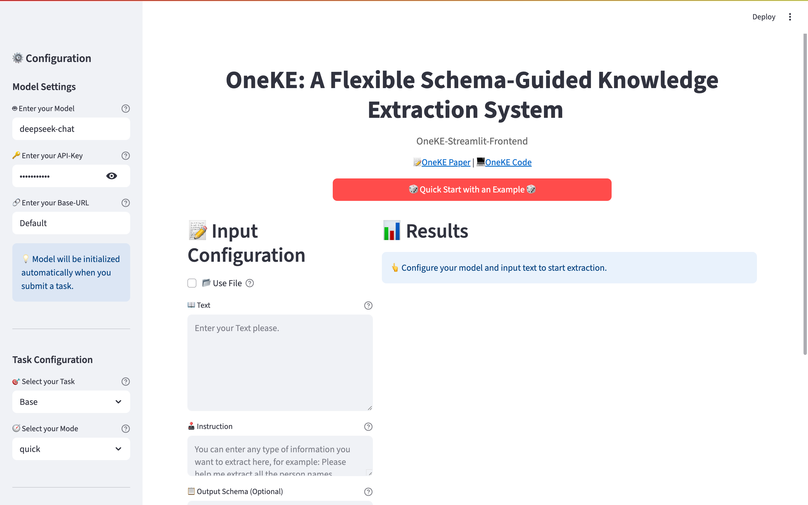</td>
        <td>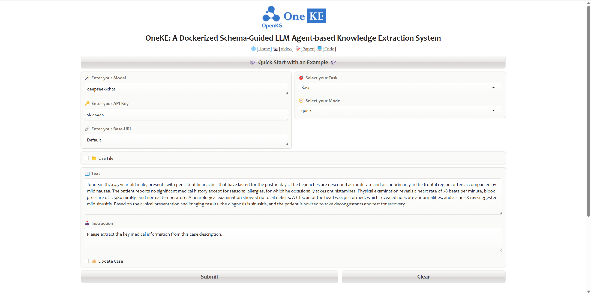</td>
    </tr>
</table>

Here are three main function buttons:

1. `🎲 Quick Start with an Example 🎲`: Quickly get a simple example to try OneKE.
2. `Submit`: After configuring your customized tasks, click this button to run.
3. `Clear`: When a task is completed, click this button to restore.

### Model Configuration

<table>
    <tr>
        <td>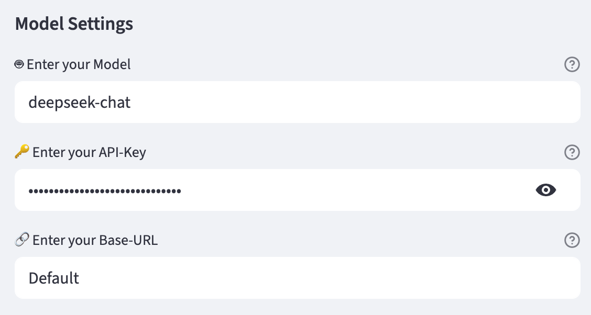</td>
        <td>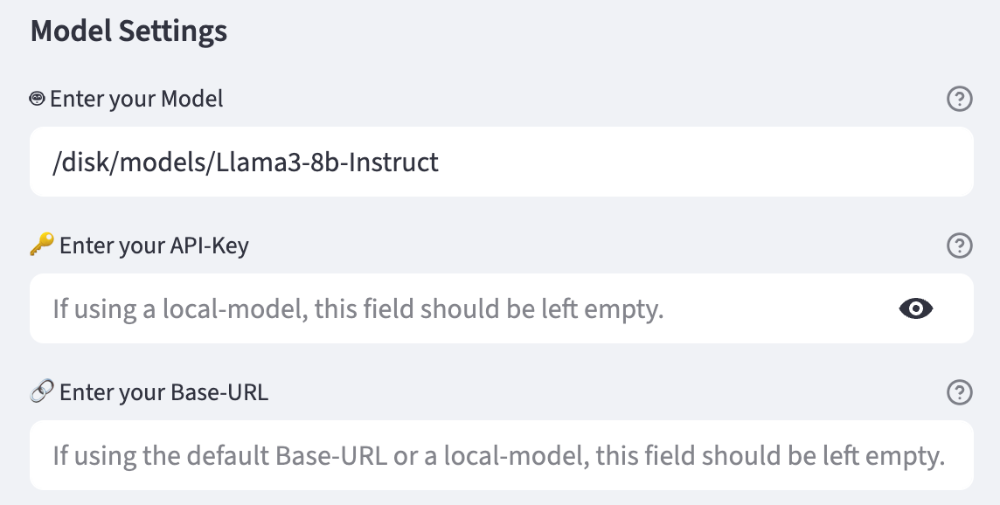</td>
    </tr>
</table>

1. `🪄 Enter your Model`: You can enter your model name here, such as *gpt-4o-mini*, *o3-mini*, *deepseek-chat*, *deepseek-reasoner*, etc. We also support local models — just input the local model path. For more details, please read [this part](#extraction-model-support).
2. `🔑 Enter your API-Key`: Enter your model's API key here. We ensure the security of your information. If you are using a local model, you don’t need to fill in this field.
3. `🔗 Enter your Base-URL`: We support any custom Base-URL. If you are using the default URL, please leave this field empty.

### Task Configuration

<table>
    <tr>
        <td>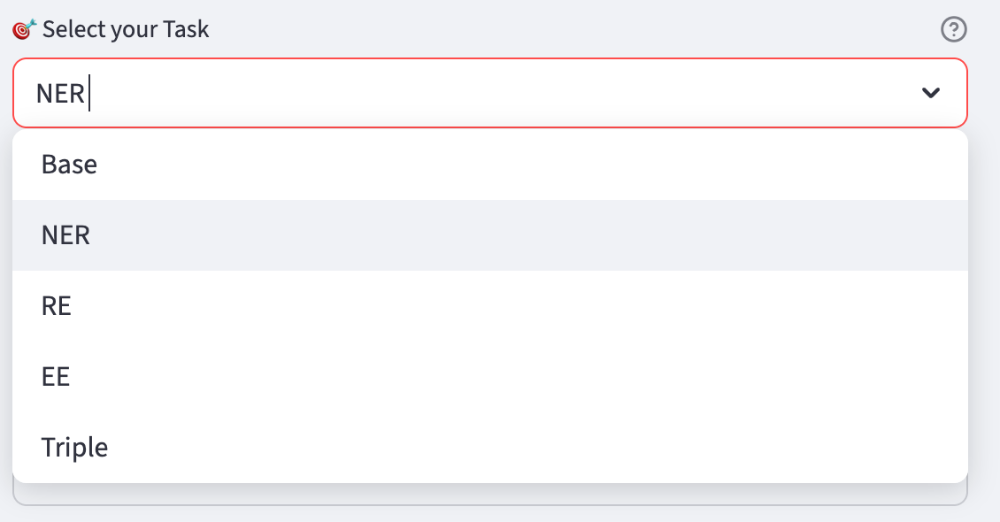</td>
        <td>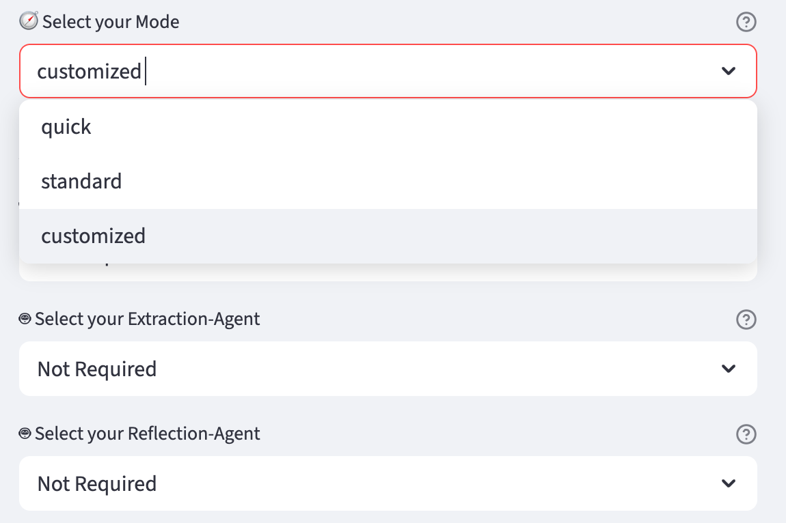</td>
    </tr>
</table>


1. `🎯 Select your Task`: Choose your task. We support both **Traditional IE** (NER, RE, EE, and Triple for knowledge graph) and **Open Domain IE** such as Web News Extraction, Book Knowledge Extraction, and **any other extraction task** you want. For more details, please read [this part](#extraction-task-support).
2. `🧭 Select your Mode`: Choose your extraction method. We offer predefined agent combinations, or you can fully `customize` your own agent strategy. For longer text extraction tasks, we recommend using the `direct mode`; For shorter tasks requiring high accuracy, you can try the `standard mode`. If you're customizing the mode and don't need any agent, simply select `Not Required`. For more details, please read [this part](#extraction-method-support).

### Text Input

<table>
    <tr>
        <td>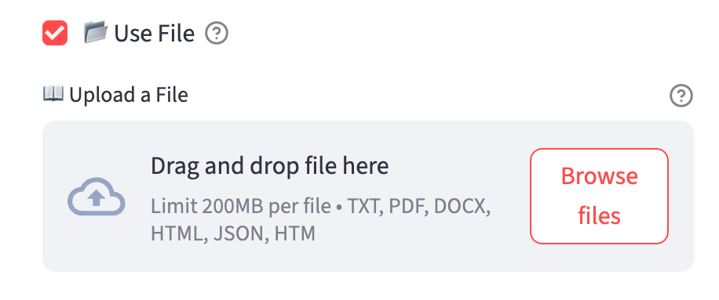</td>
        <td>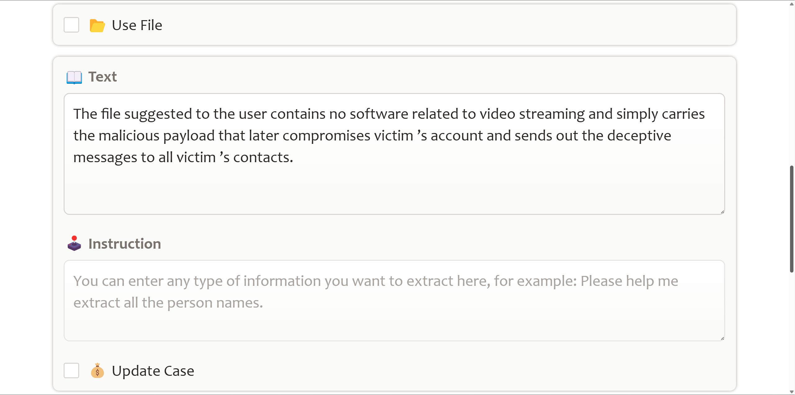</td>
    </tr>
</table>

1. `📂 Use File`: You can either input the text or upload a file.
2. `📖 Upload a File`: If you want to upload a file, make sure the `📂 Use File` is checked first. Then you can drop a file here or click to upload. We support various file formats such as *.pdf*, *.html*, etc. For more details, please read [this part](#data-source-support).
3. `📖 Text`: You can enter text in any language here.

### Set Instruction

<table>
    <tr>
        <td>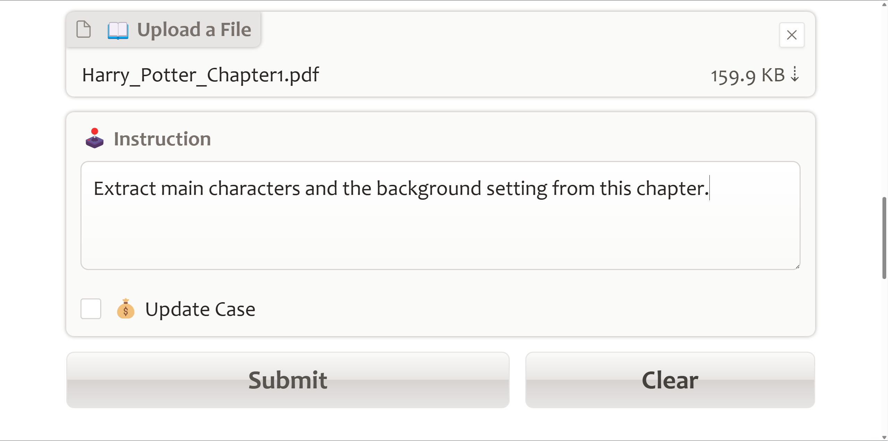</td>
        <td>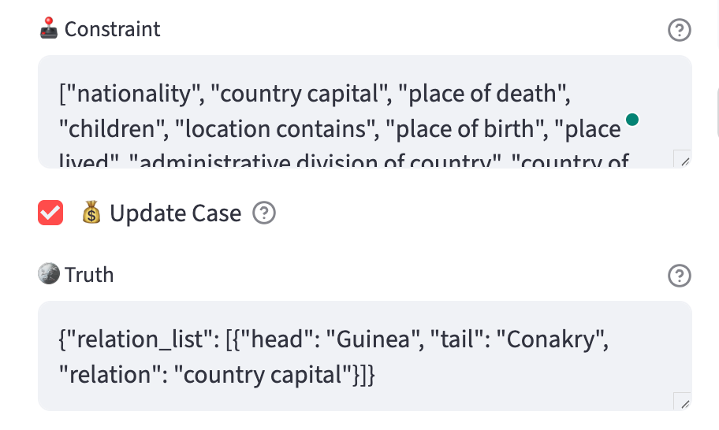</td>
    </tr>
</table>

1. `🕹️ Instruction`: You can enter any type of information you want to extract here, for example: *Please help me extract all the person names*.
2. `💰 Update Case`: Check this box if you want to update the **Case Repository**, then you need to provide your truth. For more details, please read [this part](#2-case-repository).
3. `🪙 Truth`: You can enter the truth you want LLMs to know, for example: *{"relation_list": [{"head": "Guinea", "tail": "Conakry", "relation": "country capital"}]}*.

### Get Result

<table>
    <tr>
        <td>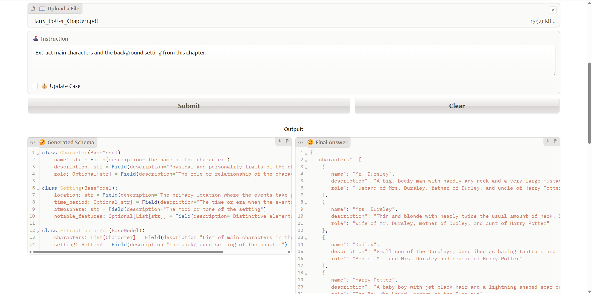</td>
        <td>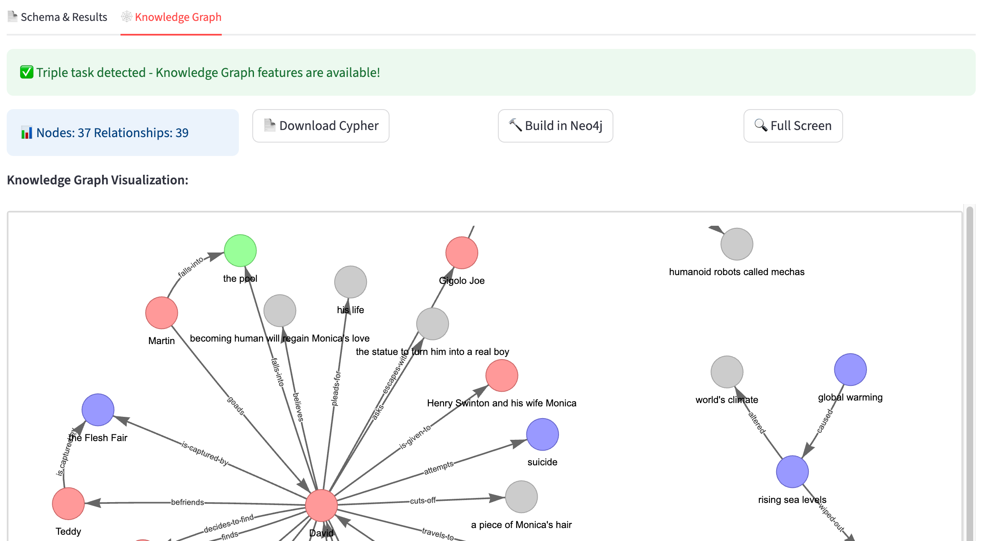</td>
    </tr>
</table>

After configuring your customized tasks, click the `Submit` button to run. The results will be displayed here:

1. **`🤔 Generated Schema`**: This is the extraction schema automatically generated by OneKE for your task, presented in a structured **Python class** format.
2. **`😉 Final Answer`**: This is the final extraction result, presented in structured **JSON** format.
3. `😵‍💫 Error capture`: This section displays all error messages caught during the process, such as network issues, etc. For more details, please read [this part](#️network-issue-solutions).

## 🔍Further Usage
### 💡Extraction Task Support
You can try different types of information extraction tasks within the OneKE framework.
| **Task** | **Description** |
| :---: | :---: |
| ***Traditional IE*** |   |
| NER | Named Entity Recognition, identifies and classifies various named entities such as names, locations, and organizations in text. |
| RE | Relation Extraction, identifies relationships between entities, and typically returns results as entity-relation-entity triples. |
| EE | Event Extraction, identifies events in text, focusing on event triggers and associated participants, known as event arguments. |
| Triple | Triple Extraction, identifies subject-predicate-object triples in text. A triple is a fundamental data structure in information extraction, representing a piece of knowledge or fact. Knowledge graph can be quickly constructed after the Triple Extraction. |
| ***Open Domain IE***||
| Web News Extraction| Involves extracting key entities and events from online news articles to generate structured insights. |
| Book Knowledge Extraction | Extracts information such as key concepts, themes, and facts from book chapters. |
| Other | Encompasses information extraction from different types of content, such as social media and research papers, each tailored to the specific context and data type. |

In subsequent code processing, we categorize tasks into four types: `NER` for Named Entity Recognition, `RE` for Relation Extraction, `EE` for Event Extraction, `Triple` for Triple Extraction, and `Base` for any other user-defined open-domain extraction tasks.


#### 1. Named Entity Recognition
Named entity recognition seeks to locate and classify named entities mentioned in unstructured text into pre-defined entity types such as person names, organizations, locations, organizations, etc.

Refer to the case defined in `examples/config/NER.yaml` as an example:
| Text | Entity Types |
| --- |--- |
| Finally, every other year, ELRA organizes a major conference LREC, the International Language Resources and Evaluation Conference. | Algorithm, Conference, Else, Product, Task, Field, Metrics, Organization, Researcher, Program Language, Country, Location, Person, University |

In this task setting, `Text` represents the text to be extracted, while `Entity Types` denote the constraint on the types of entities to be extracted. Accordingly, we set the `text` and `constraint` attributes in the YAML file to their respective values.

Next, follow the steps below to complete the NER task:

- Complete `./examples/config/NER.yaml`:

  configure the necessary model and extraction settings.

- Run the shell script below:
  ```bash
  config_file=./examples/config/NER.yaml
  python src/run.py --config $config_file
  ```
  ( Refer to [issues](#network-issue-solutions) for any network issues. )

The final extraction result should be:
| Text | Conference |
| --- | --- |
| Finally, every other year, ELRA organizes a major conference LREC, the International Language Resources and Evaluation Conference. | ELRA, LREC, International Language Resources and Evaluation Conference |

Click [here](https://github.com/zjunlp/OneKE/tree/main/examples/results/NER.json) to obtain the raw results in `json` format.
> Note: The actual extraction results may not exactly match this due to LLM randomness.

The result indicates that, given the text and entity type constraint, entities of type `conference` have been extracted: `ELRA`, `conference`, `International Language Resources and Evaluation Conference`.

You can either specify entity type constraints or omit them. Without constraints, OneKE will extract all entities from the sentence.


#### 2. Relation Extraction
Relationship extraction is the task of extracting semantic relations between entities from a unstructured text.

Refer to the case defined in `examples/config/RE.yaml` as an example:
| Text | Relation Types |
| --- |--- |
|  The aid group Doctors Without Borders said that since Saturday , more than 275 wounded people had been admitted and treated at Donka Hospital in the capital of Guinea , Conakry . | Nationality, Country Capital, Place of Death, Children, Location Contains, Place of Birth, Place Lived, Administrative Division of Country, Country of Administrative Divisions, Company, Neighborhood of, Company Founders |

In this task setting, `Text` represents the text to be extracted, while `Relation Types` denote the constraint on the types of relations of entities to be extracted. Accordingly, we set the `text` and `constraint` attributes in the YAML file to their respective values.

Next, follow the steps below to complete the RE task:
- Complete `./examples/config/RE.yaml`:
  configure the necessary model and extraction settings
- Run the shell script below:
  ```bash
  config_file=./examples/config/RE.yaml
  python src/run.py --config $config_file
  ```
  ( Refer to [issues](#network-issue-solutions) for any network issues. )

The final extraction result should be:

| Text | Head Entity | Tail Entity | Relationship |
| --- | --- | --- | --- |
| The aid group Doctors Without Borders said that since Saturday , more than 275 wounded people had been admitted and treated at Donka Hospital in the capital of Guinea , Conakry . | Guinea | Conakry | Country-Capital |

Click [here](https://github.com/zjunlp/OneKE/tree/main/examples/results/RE.json) to obtain the raw results in `json` format.
> Note: The actual extraction results may not exactly match this due to LLM randomness.

The result indicates that, the relation `Country-Capital` is extracted from the given text based on the relation list, accompanied by the corresponding head entity `Guinea` and tail entity `Conakry`, which denotes that `Conakry is the capital of Guinea`.

You can either specify relation type constraints or omit them. Without constraints, OneKE will extract all relation triples from the sentence.


#### 3. Event Extraction
Event extraction is the task to extract event type, event trigger words, and event arguments from a unstructed text, which is a more complex IE task compared to the first two.

Refer to the case defined in `examples/config/EE.yaml` as an example:

The extraction text is:

```
UConn Health , an academic medical center , says in a media statement that it identified approximately 326,000 potentially impacted individuals whose personal information was contained in the compromised email accounts.
```
while the event type constraint is formatted as follows:
| Event Type | Event Argument |
| --- | --- |
| phishing | damage amount, attack pattern, tool, victim, place, attacker, purpose, trusted entity, time |
| data breach | damage amount, attack pattern, number of data, number of victim, tool, compromised data, victim, place, attacker, purpose, time |
| ransom | damage amount, attack pattern, payment method, tool, victim, place, attacker, price, time |
| discover vulnerability | vulnerable system, vulnerability, vulnerable system owner, vulnerable system version, supported platform, common vulnerabilities and exposures, capabilities, time, discoverer |
| patch vulnerability | vulnerable system, vulnerability, issues addressed, vulnerable system version, releaser, supported platform, common vulnerabilities and exposures, patch number, time, patch |

Each event type has its own corresponding event arguments.

Next, follow the steps below to complete the EE task:
- Complete `./examples/config/EE.yaml`:
  configure the necessary model and extraction settings
- Run the shell script below:
  ```bash
  config_file=./examples/config/EE.yaml
  python src/run.py --config $config_file
  ```
  ( Refer to [issues](#network-issue-solutions) for any network issues. )

The final extraction result should be:

<table>
  <tr>
    <th>Text</th>
    <th>Event Type</th>
    <th>Event Trigger</th>
    <th>Argument</th>
    <th>Role</th>
  </tr>
  <tr>
    <td rowspan="4">UConn Health , an academic medical center , says in a media statement that it identified approximately 326,000 potentially impacted individuals whose personal information was contained in the compromised email accounts.</td>
    <td rowspan="4">data breach</td>
    <td rowspan="4">compromised</td>
    <td>email accounts</td>
    <td>compromised data</td>
  </tr>
  <tr>
    <td>326,000</td>
    <td>number of victim</td>
  </tr>
  <tr>
    <td>individuals</td>
    <td>victim</td>
  </tr>
  <tr>
    <td>personal information</td>
    <td>compromised data</td>
  </tr>
</table>

Click [here](https://github.com/zjunlp/OneKE/tree/main/examples/results/EE.json) to obtain the raw results in `json` format.
> Note: The actual extraction results may not exactly match this due to LLM randomness.

The extraction results show that the `data breach` event is identified using the trigger `compromised`, and the specific contents of different event arguments such as `compromised data` and `victim` have also been extracted.

You can either specify event constraints or omit them. Without constraints, OneKE will extract all events from the sentence.

#### 4. Triple Extraction

Triple Extraction identifies subject-predicate-object triples in text. A triple is a fundamental data structure in information extraction, representing a piece of knowledge or a fact. Knowledge Graph (KG) can be quickly constructed after the Triple Extraction.

Here is an example:

| Text                                                         | Subject Entity Types | Relation Types   | Object Entity Types |
| ------------------------------------------------------------ | -------------------- | ---------------- | ------------------- |
| The international conference on renewable energy technologies was held in Berlin. Several researchers presented their findings, discussing new innovations and challenges. The event was attended by experts from all over the world, and it is expected to continue in various locations. | Event, Person        | Action, Location | Place, Concept      |

The final extraction result should be:

| Subject Entity       | Relation                    | Object Entity             |
| -------------------- | --------------------------- | ------------------------- |
| Conference (Event)   | was held in (Location)      | Berlin (Place)            |
| Researchers (Person) | presented (Action)          | findings (Concept)        |
| Researchers (Person) | discussed (Action)          | innovations (Concept)     |
| Conference (Event)   | will continue in (Location) | various locations (Place) |
| Experts (Person)     | attended (Action)           | event (Event)             |
| Event (Event)        | is attended by (Location)   | experts (Person)          |

Let's start in OneKE ~

The constraint can be customed as multiple styles, and it's formatted as follows:

* Define `entity types` only:

    If you only need to specify the entity types, the `constraint` should be a single list of strings representing the different entity types.

```python
["Person", "Place", "Event", "property"]
```

* Define `entity types` and `relation types`:

    If you need to specify both entity types and relation types, the `constraint` should be a nested list. The first list contains the entity types, and the second list contains the relation types.

```python
[["Person", "Place", "Event", "property"], ["Interpersonal", "Located", "Ownership", "Action"]]
```

* Define `subject entities types`, `relation types`, and `object entities types`:

    If you need to define the types of subject entities, relation types, and object entities, the `constraint` should be a nested list. The first list contains the subject entity types, the second list contains the relation types, and the third list contains the object entity types.

```python
[["Person"], ["Interpersonal", "Ownership"], ["Person", "property"]]
```

Next, follow the steps below to complete the Triple extraction task:

- Complete `./examples/config/Triple2KG.yaml`:

    configure the necessary model and extraction settings.

- Run the shell script below:

    ```bash
    config_file=./examples/config/Triple2KG.yaml
    python src/run.py --config $config_file
    ```

    ( Refer to [issues](#network-issue-solutions) for any network issues. )

Here is an [example](https://github.com/zjunlp/OneKE/tree/main/examples/config/Triple2KG.yaml) to start. And access a raw [results](https://github.com/zjunlp/OneKE/tree/main/examples/results/TripleExtraction.json) in JSON format here.

> ⚠️ Warning: If you do not intend to build a Knowledge Graph, make sure to remove or comment out the construct field in the yaml file. This will help avoid errors related to database connection issues.

##### Build Knowledge-Graph

 ✨ If you need to construct your Knowledge Graph (KG) **with your Triple Extraction result**, you can refer to this [example](https://github.com/zjunlp/OneKE/tree/main/examples/config/Triple2KG.yaml) for guidance. Mimic this example and add the `construct` field. Just update the field with your own database parameters.

```yaml
construct: # (Optional) If you want to construct a Knowledge Graph, you need to set the construct field, or you must delete this field.
  database: Neo4j # your database type.
  url: neo4j://localhost:7687 # your database URL，Neo4j's default port is 7687.
  username: your_username # your database username.
  password: "your_password" # your database password.
```

Once your database is set up, you can access your graph database through a browser. For Neo4j, the web interface connection URL is usually:

```
http://localhost:7474/browser
```

For additional information regarding the Neo4j database, please refer to it's [documentation](https://neo4j.com/docs).

> ⚠️ Warning Again: If you do not intend to build a Knowledge Graph, make sure to remove or comment out the construct field in the yaml file. This will help avoid errors related to database connection issues.

#### 5. Open Domain IE

This type of task is represented as `Base` in the code, signifying any other user-defined open-domain extraction tasks.

We refer to the [example](#step1-prepare-the-configuration-file) above for guidance.

In the context of customized **Web News Extraction**, we first set the extraction instruction to `Extract key information from the given text`, and provide the file path to extract content from the file. We specify the output schema from the schema repository as the predefined `NewsReport`, and then proceed with the extraction.

Next, follow the steps below to complete this task:
- Complete `./examples/config/NewsExtraction.yaml `:
  configure the necessary model and extraction settings
- Run the shell script below:
  ```bash
  config_file=./examples/config/NewsExtraction.yaml
  python src/run.py --config $config_file
  ```
  ( Refer to [issues](#network-issue-solutions) for any network issues. )

Here is an excerpt of the extracted content:
| **Title**                        | Meet Trump's pick for director of national intelligence |
|----------------------------------|--------------------------------------------------------------------------------|
| **Summary**                      | Tulsi Gabbard, chosen by President-elect Donald Trump for director of national intelligence, faces a Senate confirmation challenge due to her lack of experience and controversial views. Accusations include promoting an anti-American agenda and having troubling ties with U.S. adversaries. |
| **Publication Date**             | 2024-12-04T17:06:00Z                                                           |
| **Keywords**                     | Tulsi Gabbard; director of national intelligence; Donald Trump; Senate confirmation; intelligence agencies |
| **Events**                       | Tulsi Gabbard's nomination leads to a Senate confirmation battle due to controversies.                           |
| **People Involved**              | Tulsi Gabbard: Nominee for director of national intelligence; Donald Trump: President-elect; Tammy Duckworth: Democratic Senator; Olivia Troye: Former Trump administration national security official |
| **Quotes**                       | "The U.S. intelligence community has identified her as having troubling relationships with America’s foes."; "If Gabbard is confirmed, America’s allies may not share as much information with the U.S."  |
| **Viewpoints**                   | Gabbard's nomination is considered alarming and dangerous for U.S. national security; Her anti-war stance and criticism of military interventions draw both support and criticism. |

Click [here](https://github.com/zjunlp/OneKE/tree/main/examples/results/NewsExtraction.json) to obtain the raw results in `json` format.
> Note: The actual extraction results may not exactly match this due to LLM randomness.

In contrast to eariler tasks, the `Base-Type` Task requires you to provide an explicit `Instruction` that clearly defines your extraction task, while not allowing the setting of `constraint` values.


### 💡Data Source Support
You can choose source texts of various lengths and forms for extraction.
  | **Source Format** | **Description** |
  | :---: | :---: |
  | Plain Text | String form of raw natural language text. |
  | HTML Source | Markup language for structuring web pages. |
  | PDF File | Portable format for fixed-layout documents. |
  | Word File | Microsoft Word document format, with rich text. |
  | TXT File | Basic text format, easily opened and edited. |
  | Json File | Lightweight format for structured data interchange. |

In practice, you can use the YAML file configuration to handle different types of text input:
- **Plain Text**:  Set `use_file` to `false` and enter the text to be extracted in the `text` field.
  For example:
  ```yaml
  use_file: false
  text: Finally , every other year , ELRA organizes a major conference LREC , the International Language Resources and Evaluation Conference .
  ```
- **File Content**: Set `use_file` to `true` and specify the file path in `file_path` for the text to be extracted.
  For example:
  ```yaml
  use_file: true
  file_path: ./data/input_files/Tulsi_Gabbard_News.html
  ```


### 💡Extraction Model Support
You can choose from various open-source or proprietary model APIs to perform information extraction tasks.
> Note: For complex IE tasks, we recommend using powerful models like **OpenAI**'s or or **large-scale** open-source LLMs.

  | **Model** | **Description** |
  | :---: | :---: |
  | ***API Service*** |   |
  | OpenAI |  A series of GPT foundation models offered by OpenAI, such as GPT-3.5 and GPT-4-turbo, which are renowned for their outstanding capabilities in natural language processing. |
  | DeepSeek | High-performance LLMs that have demonstrated exceptional capabilities in both English and Chinese benchmarks. |
  | ***Local Deploy***|
  | LLaMA3-Instruct series| Meta's series of large language models, with tens to hundreds of billions of parameters, have shown advanced performance on industry-standard benchmarks. |
  | Qwen2.5-Instruct series| LLMs developed by the Qwen team, come in various parameter sizes and exhibit strong capabilities in both English and Chinese. |
  | ChatGLM4-9B | The latest model series by the Zhipu team, which achieve breakthroughs in multiple metrics, excel as bilingual (Chinese-English) chat models. |
  | MiniCPM3-4B | A lightweight language model with 4B parameters,  matches or even surpasses 7B-9B models in most evaluation benchmarks.|
  | OneKE | A large-scale model for knowledge extraction jointly developed by Ant Group and Zhejiang University.
  | DeepSeek-R1 series| A bilingual Chinese-English strong reasoning model series provided by DeepSeek, featuring the original DeepSeek-R1 and various distilled versions based on smaller models. |
  > Note: We recommend deploying the DeepSeek-R1 models with VLLM.


In practice, you can use the YAML file configuration to employ various LLMs:
- **API Service**:  Set the `model_name_or_path` to the available model name provided by the company, and enter your `api_key` as well as the `base_url`.
  For exmaple:
  ```yaml
  model:
    category: DeepSeek # model category, chosen from ChatGPT and  DeepSeek
    model_name_or_path: deepseek-chat # model name, chosen from deepseek-chat and deepseek-reasoner. Choose deepseek-chat to use DeepSeek-V3 or choose deepseek-reasoner to use DeepSeek-R1.
    api_key: your_api_key # your API key for the model with API service.
    base_url: https://api.deepseek.com # base URL for the API service. No need for open-source models.
  ```
- **Local Deploy**: Set the `model_name_or_path` to either the model name on Hugging Face or the path to the local model. We support using either `Transformer` or `vllm` to access the models.
  - Transformer Example:
    ```yaml
    model:
      category: LLaMA # model category, chosen from LLaMA, Qwen, ChatGLM, MiniCPM, OneKE.
      model_name_or_path: meta-llama/Meta-Llama-3-8B-Instruct # model name to download from huggingface or use the local model path.
      vllm_serve: false # whether to use the vllm. Default set to false.
    ```
    Note that the category of deployment model **must** be chosen from LLaMA, Qwen, ChatGLM, MiniCPM, OneKE.
  - VLLM Example:
    ```yaml
    model:
      category: DeepSeek # model category
      model_name_or_path: meta-llama/Meta-Llama-3-8B-Instruct # model name to download from huggingface or use the local model path.
      vllm_serve: true # whether to use the vllm. Default set to false.
    ```
    Note that the **DeepSeek-R1** series models only support **VLLM** deployment. Remember to **start the VLLM service** before running the extraction task. The reference code is as follows:
    ```shell
    config_file=your_yaml_file_path # REMEMBER to set vllm_serve to TRUE!
    python src/models/vllm_serve.py --config $config_file # deploy local model via vllm, executed in the OneKE directory
    ```
    You can also run the command `vllm serve model_name_or_path` directly to start the VLLM service. See the [official documents](https://docs.vllm.ai/en/latest/getting_started/quickstart.html) for more details.

### 💡Extraction Method Support
You can freely combine different extraction methods to complete the information extraction task.
  | **Method** | **Description** |
  | :---: | :---: |
  | ***Schema Agent*** |   |
  | Default Schema | Use the default JSON output format. |
  | Predefined Schema | Utilize the predefined output schema retrieved from the knowledge base. |
  | Self Schema Deduction | Generate the output schema by inferring from the task description and the source text. |
  | ***Extraction Agent***|
  | Direct IE | Directly extract information from the given text based on the task description. |
  | Case Retrieval | Retrieve similar good cases from the knowledge base to aid in the extraction. |
  | ***Reflection Agent***|
  | No Reflection| Directly return the extraction results. |
  | Case Reflection  | Use the self-consistency approach, and if inconsistencies appear, reflect on the original answer by retrieving similar bad cases from the knowledge base. |

The configuration for detail extraction methods and mode information can be found in `src/config.yaml`. You can customize the extraction methods by modifying the `customized` within this file and set the `mode` to customize in an external configuration file.

For example, first configure the `src/config.yaml` as follows:
```yaml
# src/config.yaml
customized:
    schema_agent:  get_deduced_schema
    extraction_agent: extract_information_direct
    reflection_agent: reflect_with_case
```
Then, set the `mode` of your custom extraction task in `examples/customized.yaml` to `customized`:

```yaml
# examples/customized.yaml
mode: customized
```
This allows you to experience the customized extraction methods.

> Tips:
> - For longer text extraction tasks, we recommend using the `direct mode` to avoid issues like attention dispersion and increased processing time.
> - For shorter tasks requiring high accuracy, you can try the `standard mode` to ensure precision.


### 💡Knowledge Base Configuration
#### 1. Schema Repository
You can view the predefined schemas within the `src/modules/knowledge_base/schema_repository.py` file. The Schema Repository is designed to be easily extendable. You just need to define your output schema in the form of a pydantic class following the format defined in the file, and it can be directly used in subsequent extractions.

For example, add a new schema in the schema repository:
```python
# src/modules/knowledge_base/schema_repository.py
class ChemicalSubstance(BaseModel):
    name: str = Field(description="Name of the chemical substance")
    formula: str = Field(description="Molecular formula")
    appearance: str = Field(description="Physical appearance")
    uses: List[str] = Field(description="Primary uses")
    hazards: str = Field(description="Hazard classification")

class ChemicalList(BaseModel):
  chemicals: List[ChemicalSubstance] = Field(description="List of chemicals")
```

Then, set the method for `schema_agent` under `customized` to `get_retrieved_schema` in `src/config.yaml`. Finally, set the `mode` to `customized` in the external configuration file to enable custom schema extraction.

In this example, the extraction results will be a list of **chemical substances** that strictly adhere to the defined schema, ensuring a high level of accuracy and flexibility in the extraction results.

Note that the names of newly created objects **should not conflict with** existing ones.

#### 2. Case Repository
You can directly view the case storage in the `src/modules/knowledge_base/case_repository.json` file, but we do not recommend modifying it directly.

The Case Repository is automatically updated with each extraction process once setting `update_repository` to `True` in the configuration file.

When updating the Case Repository, you must provide external feedback to generate case information, either by including truth answer in the configuration file or during the extraction process.

Here is an example:
```yaml
  # examples/config/RE.yaml
  truth: {"relation_list": [{"head": "Guinea", "tail": "Conakry", "relation": "country capital"}]} # Truth data for the relation
  update_case: true
```

After extraction, OneKE compares results with the truth answer, generates analysis, and finally stores the case in the repository.


## 🛠️Network Issue Solutions
Here are some network issues you might encounter and the corresponding solutions.

- Pip Installation Failure: Use mirror websites, run the command as `pip install -i [mirror-source] ...`.
- Docker Image Pull Failure: Configure the docker daemon to add repository mirrors.
- Nltk Download Failure: Manually download the `nltk` package and place it in the proper directory.
- Model Dowload Failure: Use the `Hugging Face Mirror` site or `ModelScope` to download model, and specify the local path to the model when using it.
    > Note: We use `all-MiniLM-L6-v2` model by default for case matching, so it needs to be downloaded during execution. If network issues occur, manually download the model, and update the `embedding_model` to its local path in the `src/config.yaml` file.


## 🎉Contributors

[Ningyu Zhang](https://person.zju.edu.cn/en/ningyu), [Haofen Wang](https://tjdi.tongji.edu.cn/TeacherDetail.do?id=4991&lang=_en), Yujie Luo, Xiangyuan Ru, Kangwei Liu, Lin Yuan, Mengshu Sun, Lei Liang, Zhiqiang Zhang, Jun Zhou, Lanning Wei, Da Zheng, Huajun Chen.

We deeply appreciate the collaborative efforts of everyone involved. We will continue to enhance and maintain this repository over the long term. If you encounter any issues, feel free to submit them to us!


## 🌻Acknowledgement
We reference [itext2kg](https://github.com/AuvaLab/itext2kg) to aid in building the schema repository and utilize tools from [LangChain](https://www.langchain.com/) for file parsing. The experimental datasets we use are curated from the [IEPile](https://huggingface.co/datasets/zjunlp/iepile) repository. We appreciate their valuable contributions!
